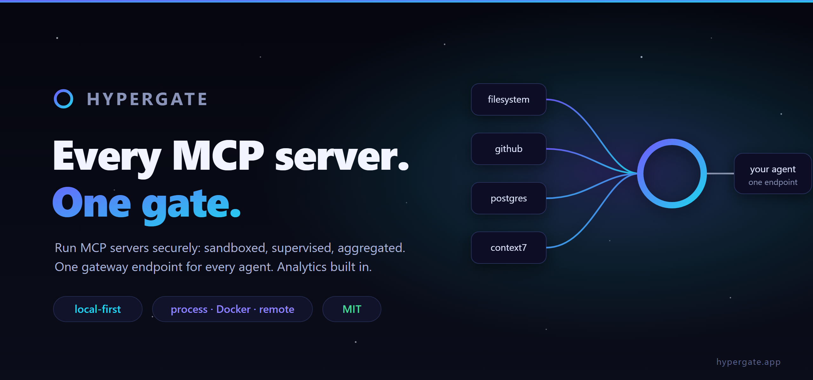

# Hypergate



**Local-first runtime and manager for MCP servers.** Run MCP servers securely, supervise them, and expose **one gateway endpoint** any agent harness (Claude Code, Cursor, [Kotrain](https://github.com/nekko-labs/kotrain), Codex) can use. Not just a connector list: a proper server runtime.

> Open source · MIT · [nekko-labs](https://github.com/nekko-labs) · [hypergate.app](https://hypergate.app)

## Install

**An installer, if you'd rather not think about it.** Grab the one for your machine from the [latest release](https://github.com/nekko-labs/hypergate/releases): a `-setup.exe` for Windows, a `.pkg` for macOS, a `.deb`/`.rpm`/tarball for Linux, each for x64 and arm64. **Nothing else is required, not even Node**: the daemon ships as a single compiled executable. You get a Start Menu / Launchpad / app-menu entry to click, the `hypergate` command on your PATH, and an entry in Add/Remove Programs. Everything installs per-user, so no admin prompt.

**Or npm, if you already have Node:**

```bash
npm install -g hypergated
hypergate start
```

That's the whole setup. `hypergate start` brings the daemon up, creates a launcher to click next time (Start Menu, Launchpad, or your app menu; add `--desktop` for a desktop icon as well), and opens the manager in your browser. Run it as often as you like: the launcher is made once, so removing it later is final, and a daemon that is already up is left alone. `--no-open` and `--no-shortcut` turn off either half, and it skips both by itself on CI, over SSH, and on a Linux box with no display, so the same command is also the right one on a headless machine (`HYPERGATE_HEADLESS=1`/`0` overrides that guess).

Either way you get two commands: `hypergate` (the CLI and tray agent, a prebuilt native binary for your platform) and `hypergated` (the daemon on its own, for headless boxes, WSL and containers). `npx hypergated` runs it without installing anything.

For the npm route, Node 20+ is required and 22.5+ is recommended, because durable usage history and logs use the built-in `node:sqlite` and older runtimes fall back to in-memory analytics. The installers bundle a runtime that always has it. The package name is `hypergated` because `hypergate` on npm belongs to an unrelated project; the command you type is still `hypergate`.

Every release also attaches the bare `hypergate` binaries, for scripting your own install.

### Updating

```bash
hypergate update           # what you have, what's out, and what updating takes here
hypergate update --apply   # install it and restart Hypergate
```

Or from the manager, without the terminal. The version in the topbar **is** the control: hover it to get **Check for updates**, and when there is one it becomes **↑ Update available v‹x›** with three choices — **Download & install**, **Download only** (take it now, install it whenever), and **Skip**. You get a real progress bar for the download and a note when the new version comes up.

`--apply` is for npm installs, which are the ones a per-user agent can safely replace: it writes an updater to the temp directory, stops Hypergate so nothing being replaced is still running, installs the new packages, starts the app again, and logs every step to `~/.hypergate/update.log`. Installed from a `.exe`/`.pkg`/`.deb` instead, or running from a checkout? Then `hypergate update` prints the exact command for that channel rather than half-doing it — the native installers aren't code-signed yet ([docs/signing.md](docs/signing.md)) and the Linux packages need root.

The packages come from npm when they're published there, and **from the release's own attached tarballs when they aren't** — every release carries `hypergated-<version>.tgz` plus one `hypergate-shell-<os>-<arch>-<version>.tgz`. Whatever is downloaded is checked against the hash the feed published before anything is installed.

## Why
Kotrain and Claude Code are MCP *clients*. Hypergate is the piece they need: a secure local *server runtime/manager*, a supervisor plus an aggregating gateway. Add servers from a catalog (or custom), pick how they're isolated, start them, and paste one URL/command into your agent.

## Isolation: your choice (the tradeoff, plainly)

| Runtime | Isolation | Pros | Cons |
|---|---|---|---|
| **Process sandbox** (default, no deps) | Scrubbed/allow-listed env, injected secrets only, restricted CWD/limits, no shell | Zero dependencies, instant, cross-platform | Weaker than a container (shared kernel) |
| **Docker** (opt-in) | Container-per-server (`docker run -i`, dropped caps, no-new-privileges) | Strong isolation + reproducibility | Requires Docker; heavier/slower cold start |
| **Remote** (hosted) | No local process at all: the gateway holds an authenticated HTTP client to the provider's hosted MCP endpoint | Nothing to install; official first-party servers; one-click OAuth sign-in | Trusts the provider; needs network |

For local runtimes the isolation model reduces to *"what command do we spawn over stdio"*: process = the server's own command; Docker = `docker run -i … image`. Remote skips the spawn entirely and connects out. Set it at setup, override per server.

## Catalog: find and add servers

- **Curated catalog** with the official first-party servers people actually reach for (Kotrain, Context7, Supabase, Linear, Figma, GitHub, Atlassian, AWS, Azure, GCP, Cloudflare, Fly.io, …), each with a verified launch config. Hypergate's recommended set is pinned first; the rest is ordered by real popularity (npm downloads / GitHub stars, fetched lazily and cached, never on boot).
- **✓ Official / Community trust chips** on every entry, so you can see at a glance whether a server is published by the vendor or the community.
- **One-click OAuth servers**: remote first-party servers (GitHub, Context7, …) add with a single button that opens the provider's browser login. No token to paste; tokens persist locally under `~/.hypergate/oauth/`.
- **Registry search** over the official open-source MCP registry (`registry.modelcontextprotocol.io`), mapped into add-ready entries.
- **Command-line tools radar**: a section that detects which CLIs the servers depend on (node/npx, uv/uvx, docker, flyctl, cloud CLIs, …), with version + path when present and an install hint when missing. Fully local, shell-free PATH scan.

## Architecture

```
packages/shared   types + daemon API contract
packages/core     RuntimeAdapter (Process | Docker | Remote) · Supervisor · aggregating Gateway · registry
apps/daemon       hypergated: one localhost port serving the web UI, the management API,
                  and the streamable-HTTP MCP gateway at /mcp (+ a `--stdio` mode)
apps/web          the management UI (served by the daemon at /)
apps/site         the hypergate.app marketing one-pager (static Vite, deployed on Vercel)
```

- **Supervisor** launches each server through its `RuntimeAdapter`, connects an MCP client, tracks state/tools/logs (secrets never logged).
- **Gateway** merges every ready server's tools (namespaced `server__tool`) into one MCP server and routes calls. Exposed over **streamable HTTP** at `/mcp` (bearer-token auth, token auto-generated and shown in the UI) and over **stdio** (`hypergated --stdio`).

## Develop

```bash
npm install
npm run build
npm test            # spawns a real stdio MCP server → aggregates it via the gateway → calls a tool
npm run smoke:http  # boots the daemon → speaks MCP over plain HTTP → 401 without the token

npm run daemon                           # UI + API + /mcp gateway on http://localhost:7777
node apps/daemon/dist/index.js --stdio   # the aggregated gateway over stdio
```

The desktop shell is Rust, so it builds separately (needs a Rust toolchain):

```bash
npm run shell:build   # cargo build --release → apps/shell/target/release/hypergate
npm run shell:test    # unit + integration tests for the tray, CLI and sandbox launcher
npm run smoke:shell   # daemon ↔ shell bridge: keychain, autostart, sandbox-exec, CLI
```

### Packaging

```bash
npm run build:npm     # assemble dist-npm/hypergated + this host's shell package
npm run smoke:install # pack it, install into a clean project, drive the installed CLI
```

`scripts/build-npm.mjs` bundles the daemon into one file (esbuild, with core, shared and the MCP SDK inlined), copies the built web UI beside it, and writes the `hypergated` package plus a `hypergate-shell-<os>-<arch>` package holding the native binary. The main package lists all six platform builds as **optional** dependencies guarded by npm's `os`/`cpu`, so a machine pulls exactly one, and an unsupported platform still gets a working daemon instead of a failed install.

### Installers

```bash
npm run build:standalone   # dist-standalone/: the install tree, no Node needed
npm run smoke:standalone   # boot that daemon, check the store, call a tool
npm run build:installers   # dist-installers/: this platform's installer
```

`build:standalone` compiles the daemon into a single executable with **Node's SEA** support: the esbuild bundle is injected into a copy of the Node binary, and the web UI is placed beside it (the daemon resolves its UI relative to `process.execPath` in that layout). `bun build --compile` would be less work and would cross-compile, but Bun has no `node:sqlite`, so a Bun build silently loses durable usage history and server logs. That is worth the extra machinery.

`build:installers` then wraps that tree for the host platform: NSIS on Windows, `pkgbuild`/`productbuild` on macOS, `dpkg-deb` plus `rpmbuild` on Linux. Each is built on its own OS, never cross-built, so every artifact is made by the toolchain that will run it. The definitions live in [`packaging/installers/`](packaging/installers/).

The installers deliberately reuse Hypergate's own code for the parts that need judgement: `hypergate shortcut install` creates the launcher (so a redirected OneDrive desktop is handled), `hypergate autostart on` sets the login item, and `hypergate icon` emits the mark. Uninstalling leaves `~/.hypergate` alone, since an uninstall should not throw away server configs, usage history and OAuth grants.

[`.github/workflows/build-artifacts.yml`](.github/workflows/build-artifacts.yml) builds all six platforms and can be run on demand, without cutting a release, when you want an installer to test.

Releases are cut by tag: `git tag v0.9.0 && git push --tags` runs [`.github/workflows/release.yml`](.github/workflows/release.yml), which cross-builds all six shells, publishes the platform packages and then the main package to npm with provenance, and attaches standalone binaries to the GitHub release.

### Run it as a desktop app (Windows, macOS, Linux)

```bash
npm run build && npm run shell:build && npm run tray
```

`hypergate tray` puts a tray icon in the notification area (menu bar on macOS, StatusNotifierItem on Linux) and keeps the daemon running. The menu has a live status line, **Open manager**, **Start/Stop all servers**, **Restart daemon**, **Start at login**, and **Quit**. Interaction is menu-only on every platform, because Linux's StatusNotifierItem delivers no click events and a click gesture would silently not exist there.

"Open manager" opens the web UI in your **default browser**. There is deliberately no bundled webview: you already have a better browser than any embedded one, and it avoids a hard `webkit2gtk` dependency on Linux.

The daemon stays independently runnable, so headless Linux, WSL and containers need no shell at all: run `npm run daemon` (or a systemd user unit) and skip the tray.

### The CLI

The same binary is the CLI, talking to the daemon over its HTTP API. Everything the UI does, you can do here.

```bash
# the daemon
hypergate start          # daemon + launcher + manager: the one command
hypergate start --no-open --no-shortcut   # just the daemon, for scripts and servers
hypergate status         # daemon, servers, usage, keychain, autostart and updates
hypergate stop           # stop a daemon this shell started
hypergate open           # the manager UI in your browser
hypergate update         # check for a newer version (--apply installs it)

# finding and adding servers
hypergate catalog                    # the curated catalog (★ recommended, ✓ official)
hypergate search postgres            # search the official MCP registry
hypergate add kotrain                # add a catalog entry (one step)
hypergate add fly --secret FLY_API_TOKEN=…   # or supply what it requires
hypergate add mine --command npx --arg -y --arg some-mcp-server   # a custom one
hypergate rm mine

# running them
hypergate list                       # managed servers and their state
hypergate server start|stop|restart <id>
hypergate logs <id>                  # a server's logs

# using the gateway, exactly as an agent would
hypergate tools                      # every tool the gateway exposes
hypergate tools --server kotrain     # just one server's
hypergate call kotrain__open_paw_status
hypergate call echo__echo '{"text":"nyaa"}'
hypergate call some__tool --arg count=3 --arg path=/tmp/x
hypergate gateway                    # the endpoint + token to paste into a harness

# desktop
hypergate tray                       # tray icon in the notification area / menu bar
hypergate shortcut install           # Start Menu / Launchpad / app-menu entry
hypergate shortcut install --desktop # ...and a desktop icon too (Windows)
hypergate autostart on               # login item: HKCU Run key / LaunchAgent / XDG autostart
hypergate secret check               # is an OS keychain available here?
```

**Clicking an icon to turn Hypergate on.** `hypergate shortcut install` creates a real launcher that runs the tray agent: a `.lnk` in the Start Menu (and optionally on the desktop) on Windows, a `Hypergate.app` in `~/Applications` on macOS, an XDG desktop entry plus a themed icon on Linux. All per-user, so nothing needs elevation, and `hypergate shortcut uninstall` takes them away again. The Windows shortcut carries a real multi-resolution `.ico` generated from the same code that draws the tray icon, and launching it opens no console window.

`tools` and `call` go over `/mcp` with the bearer token, the same path a connected agent takes, so they verify the real gateway rather than an internal shortcut. A tool that reports an error exits non-zero.

`add` merges a catalog entry with your overrides: `--runtime docker`, `--image`, `--url`, `--env K=V`, `--secret K=V` (injected at launch, never logged), `--cwd`, `--no-start`. A key the entry declares in `requires` is taken from your environment when you don't pass it, and adding a one-click OAuth server opens the provider's browser login.

The manager's **Settings** tab exposes the same service options:

- **Run on startup**: a real login item on all three platforms (`HKCU\…\Run`, a LaunchAgent, or an XDG autostart entry), so it reflects reality even if you change it outside the app.
- **Start minimized**: on launch, stay in the tray instead of opening the manager.

### Where things are stored

Everything is local, under `~/.hypergate/` (override with `HYPERGATE_DIR`):

| What | Where |
| --- | --- |
| Server configs, agent tokens, settings | `servers.json`, `clients.json`, `settings.json` |
| Usage history + server logs | `hypergate.db` (SQLite, WAL). Retention: 90 days of usage, 14 days of logs (`HYPERGATE_RETAIN_USAGE_DAYS` / `_LOG_DAYS`, `0` = forever) |
| Gateway token, OAuth grants | The **OS keychain** (Credential Manager / Keychain / Secret Service), falling back to files here where no keychain exists |

`npm run dev` runs the daemon + web UI together and opens the site in your browser once Vite is ready (set `HYPERGATE_OPEN=0` to skip).

### Use it from your agent

One endpoint for all your servers, and one place to connect one: **Connected agents** in the web UI. Pick your client and Hypergate wires it up — for Claude Code and the Gemini CLI it runs their own `mcp add` for you; for Cursor, VS Code, `.mcp.json` and Open Paw it hands you the snippet and the file it goes in. The exact command is always shown too, quoted for your shell, if you'd rather run it yourself:

```bash
claude mcp add -t http hypergate http://localhost:7777/mcp -H "Authorization: Bearer <token>" -s user
```

or stdio: `{ "mcpServers": { "hypergate": { "command": "hypergated", "args": ["--stdio"] } } }`

**Scoped agents.** Every connected agent has its own token and its own allow-list: pick which servers it may use (or all of them), and it will only see and call those. Its calls show up under its name in Analytics, and you can revoke it without touching anything else. The master token in the gateway bar always reaches every server — prefer an agent token for a real client. Same thing over the API: `POST /api/clients`, then `POST /api/clients/:id/connect`.

**Kotrain** auto-detects a running daemon: Settings → MCP servers → **Connect gateway** (one click), plus an **Open manager** button that opens this UI in a workbench pane.

## Analytics: visibility for free
Because every tool call fans through the one gateway, Hypergate records it: server, tool, caller (from the MCP handshake), success/error, latency, and bytes in/out. The web UI's **Analytics** tab turns that into headline metrics, a 24h call-volume sparkline, usage-by-server, a who's-calling breakdown, and a live recent-calls feed, served from `/api/analytics` and persisted across restarts. It's a private audit trail with nothing to wire up and no data leaving your machine.

## Status
Kicked off 2026-06-28. **v0.7** is the rename era: NekkoMCP became **Hypergate**, with the [hypergate.app](https://hypergate.app) marketing site (WebGL warp-gate hero, real app screenshots) shipped from `apps/site`. On the way here: **v0.6** added the expanded official catalog, ✓ Official / Community trust chips, recommended + popularity ordering, and CLI detection; **v0.5** added the **remote runtime** and one-click OAuth servers (GitHub, Context7) built on the MCP OAuth spec; **v0.4** added connected agents (scoped tokens), registry search, the tool inspector, and analytics persistence; **v0.3** the analytics engine and the list-first redesign; earlier versions the core: process + Docker runtimes, supervisor, aggregating gateway over stdio and streamable HTTP, daemon-served web UI, curated catalog, and Kotrain one-click integration. Next: resources/prompts aggregation, crash backoff, keychain secrets, registry background sync, Electron shell. See `SPEC.md`/`TASKS.md`.
